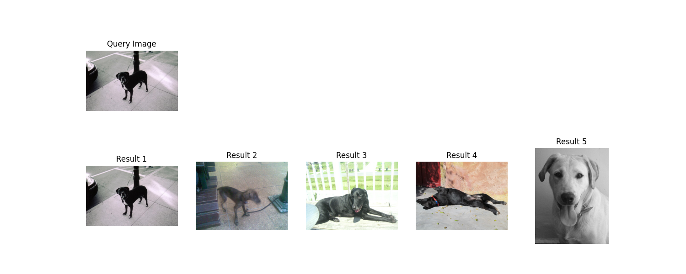
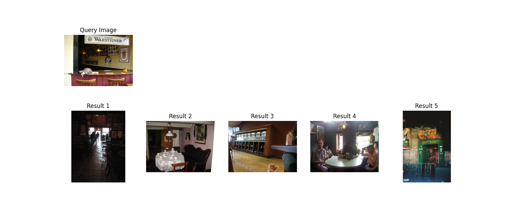
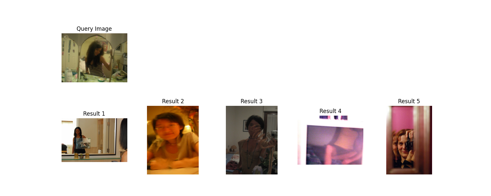
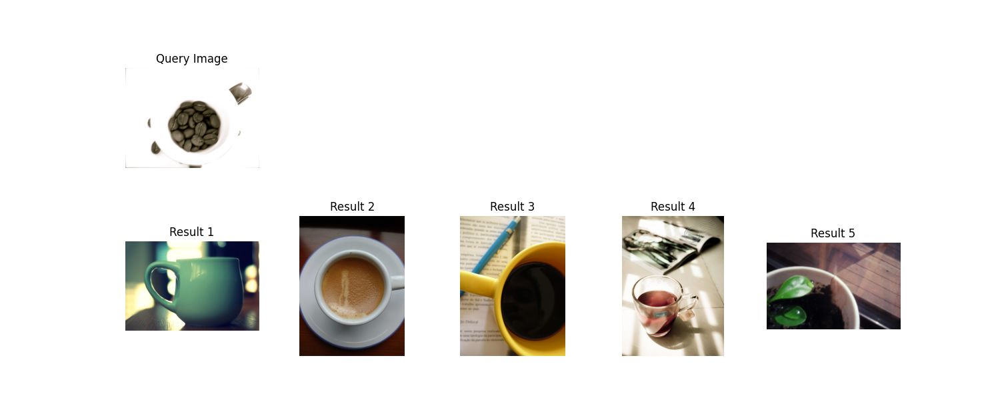
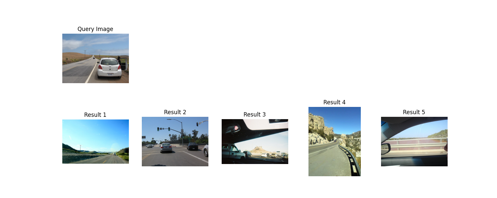
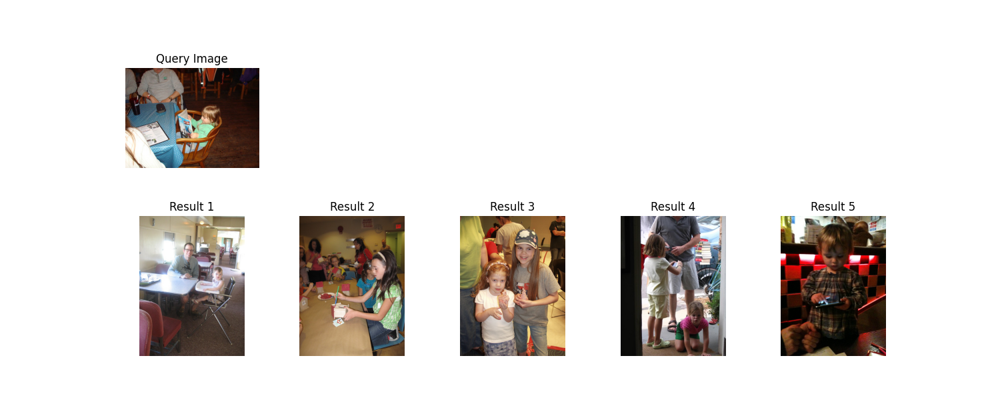
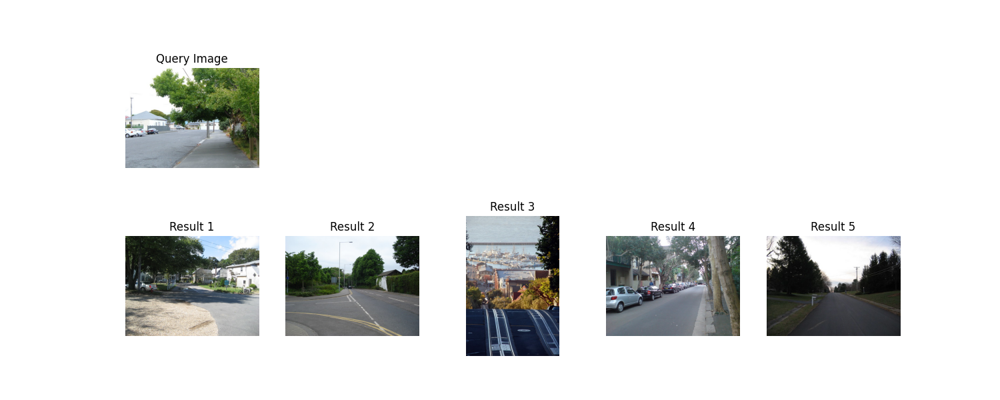
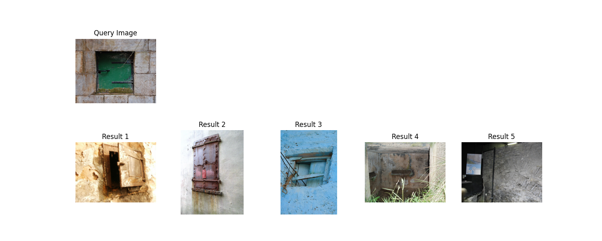

This folder contains the evaluation of 0-10000 index from the dataset. The evaluation is done by obtaining the top 5 results and computing the MAP score.

Here are the test images:
- http://static.flickr.com/2361/2261595537_66cec20f14.jpg
- http://static.flickr.com/87/271798617_3b86d68cd0.jpg
- http://static.flickr.com/2669/3875697250_2f097b9a58.jpg
- http://static.flickr.com/3126/2658294008_fe4583d9cb.jpg
- http://static.flickr.com/1081/532433926_8542123d56.jpg
- http://static.flickr.com/2707/4321347728_15081d8523.jpg
- http://static.flickr.com/2291/2252298370_3c38a5f6f5.jpg
- http://static.flickr.com/2449/4023137679_5ce8cc5847.jpg

Here are the query results:

| Query | rank 1 | rank 2 | rank 3 | rank 4 | rank 5 | AP |
|-------|--------|--------|--------|--------|--------|-----|
| 1     | 1      | 1      | 1      | 1      | 1      | 1   |
| 2     | 1      | 0      | 1      | 1      | 0      | 0.806|
| 3     | 1      | 1      | 1      | 0      | 1      | 0.950|
| 4     | 1      | 1      | 1      | 1      | 0      | 1   |
| 5     | 1      | 1      | 1      | 1      | 0      | 1   |
| 6     | 1      | 1      | 0      | 0      | 0      | 1   |
| 7     | 1      | 1      | 0      | 1      | 1      | 0.889|
| 8     | 1      | 1      | 1      | 1      | 0      | 1   |

MAP: 0.955